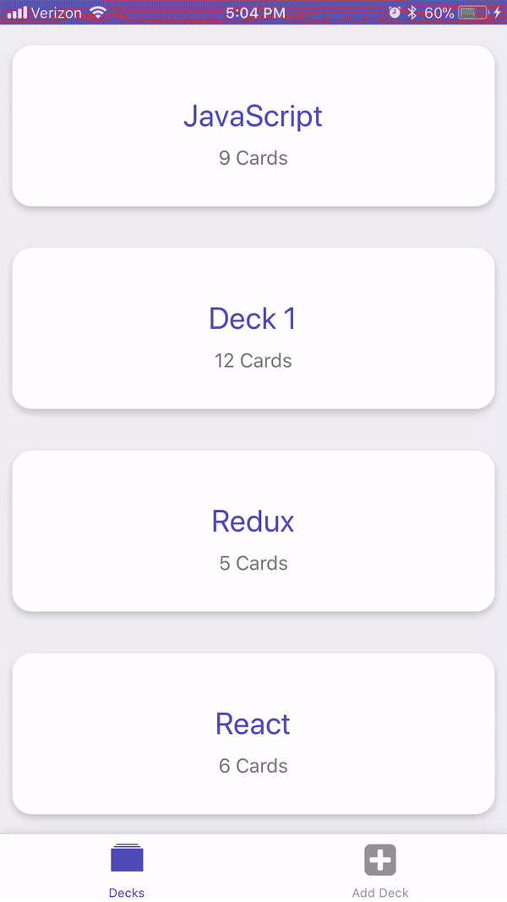

# Mobile Flashcards project

### Built using React Native by Bhargav Gandhi

This App has been tested for iOS platform only.

This project was bootstrapped with [Create React Native App](https://github.com/react-community/create-react-native-app).

Below you'll find information about performing common tasks. The most recent version of this guide is available [here](https://github.com/react-community/create-react-native-app/blob/master/react-native-scripts/template/README.md).

## Demo


## Table of Contents

* [Available Scripts](#available-scripts)
  * [yarn install](#yarn-install)
  * [yarn start](#yarn-start)


## Available Scripts

If Yarn was installed when the project was initialized, then dependencies will have been installed via Yarn, and you should probably use it to run these commands as well. Unlike dependency installation, command running syntax is identical for Yarn and NPM at the time of this writing.

### `yarn install`

Installs all required dependencies for the project.

### `yarn start`

Runs your app in development mode.

Open it in the [Expo app](https://expo.io) on your phone to view it. It will reload if you save edits to your files, and you will see build errors and logs in the terminal.

Sometimes you may need to reset or clear the React Native packager's cache. To do so, you can pass the `--reset-cache` flag to the start script:

```
npm start --reset-cache
# or
yarn start --reset-cache
```

you can press i to view it on ios simulator once you are running the app or press a for Android device emulator.

To send the expo url to your phone via number or email please press 's'
